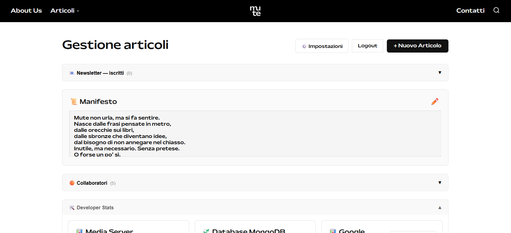
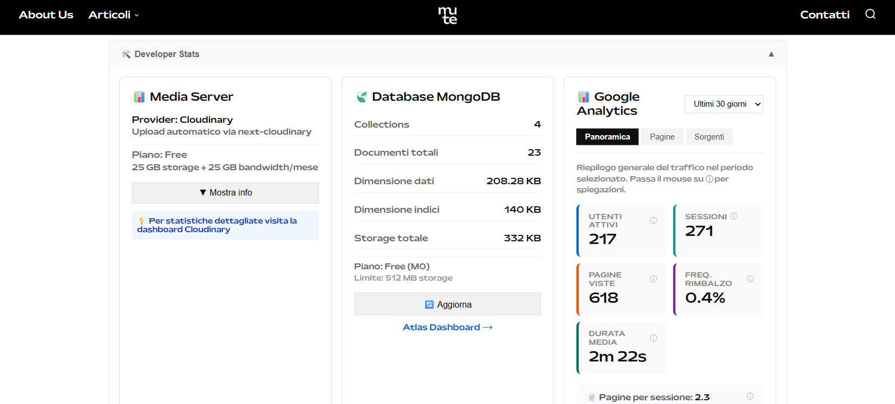
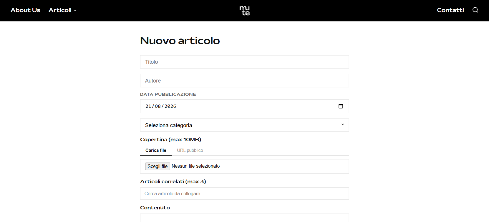

# Mute Rivista

Website for [Mute](https://www.muterivista.it) — an independent art and culture
magazine. Built solo, from the collective's design to production.

**Live:** [muterivista.it](https://www.muterivista.it)


## Admin panel

The editorial team publishes and edits everything without touching code —
including the manifesto, collaborators and newsletter subscribers.



The panel also surfaces infrastructure state at a glance: Cloudinary storage,
MongoDB collection and index size, and Google Analytics traffic.





## What it does

- Editorial content structured by category, with individual article pages
- Admin panel for the editorial team to publish and edit content without
  touching code
- Collaborators section, editable from the admin panel
- Image upload and delivery through Cloudinary
- Newsletter signup

## Stack

- **Next.js** (App Router) + **TypeScript**
- **MongoDB** for content
- **Cloudinary** for image storage and optimisation
- Deployed on **Vercel**

## Credits

- **Design:** [Asteriscollettivo](https://www.instagram.com/asteriscollettivo/)
  — art direction and visual identity, developed in collaboration
- **Editorial:** the Mute team
- **Development:** [Roman Nimets](https://www.linkedin.com/in/roman-nimets)

## Running locally

```bash
npm install
cp .env.example .env.local   # fill in your own credentials
npm run dev
```

The app runs on `http://localhost:3000`. See `.env.example` for the required
environment variables.
